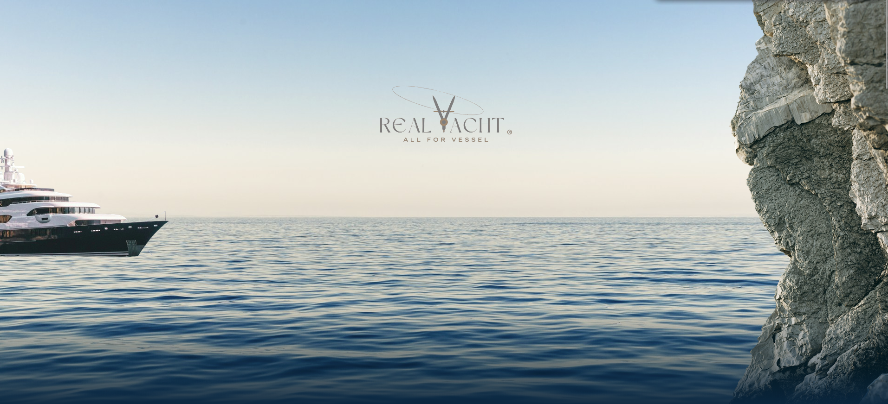
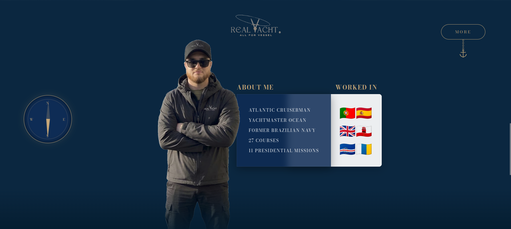
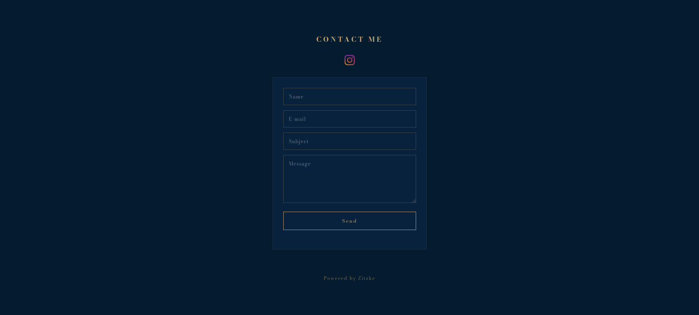
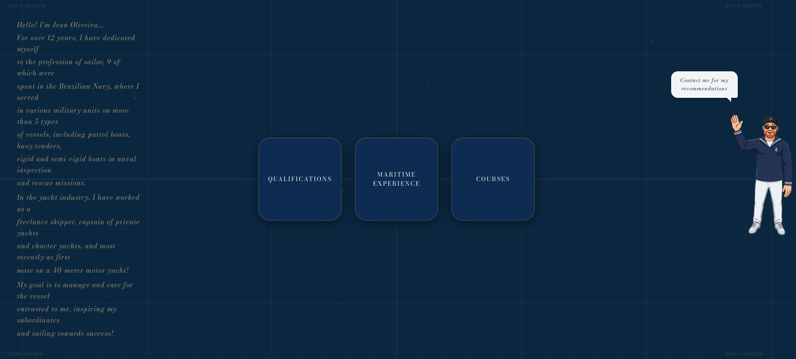

# Real Yacht - Landing Page;
Landing page developed to promote Real Yacht’s superyacht services

---

[Visite o Projeto](https://realyacht.netlify.app/)

### Sections

1. **Real Yacht:** 
2. **About:** 
3. **Contact:** 
4. **Experience:** 

## Technologies Used

The following tools and technologies were used in the development of this project:

*  
*  
*  
*  

---

**Privacy Notice:** The source code for this project is private for reasons of confidentiality and intellectual property. The repository serves solely as a showcase and documentation of my involvement and the technologies used.
